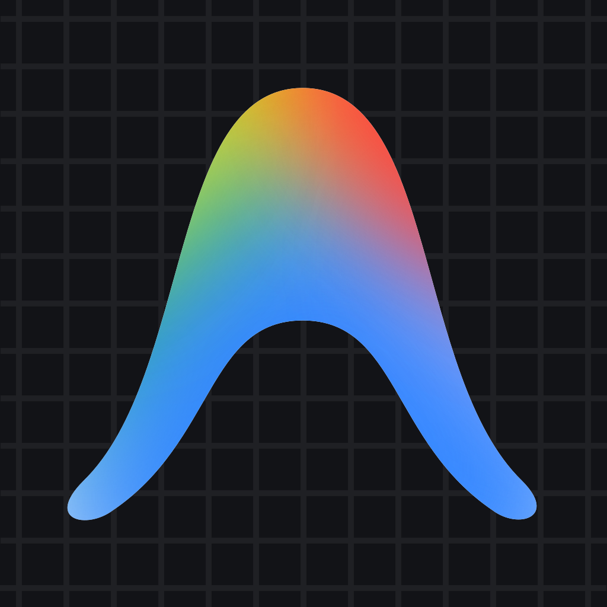

<div align="center">
  
  <h1>Antigravity Remote v4</h1>
  <p><b>Web-Native Desktop Environment for Google Antigravity IDE</b></p>
  <p>A centralized, containerized development environment running <b>Google Antigravity IDE</b> on a headless server, seamlessly accessible from any modern web browser client (Windows, Linux, macOS, tablets) using standard HTML5 Canvas and WebSocket protocols, eliminating the need for local desktop clients or X11 forwarding.</p>
</div>

---

## 1. System Architecture

Built on **Debian 12 Bookworm**, the stack integrates:
- **Google Antigravity IDE Desktop**: Native Electron application with complete IDE capabilities, extensions, and agent support.
- **Boot-Time Auto-Update**: Checks for new Google releases at startup and updates the core application binaries in-place while keeping user data and conversations 100% intact.
- **KasmVNC Server (Port 8080)**: Next-generation VNC server with integrated web server, ultra-low-latency WebP compression, differential screen rect-encoding, and bidirectional clipboard.
- **FileBrowser Quantum (Port 8081)**: Actively maintained web file manager (`gtsteffaniak/filebrowser`) serving `/home/antigravity` with drag-and-drop upload, zip download, zero-login frictionless access (`noauth`), and path-based routing under `/filebrowser`.
- **Openbox**: Ultra-lightweight window manager (~15 MB RAM) configured for borderless, maximized fullscreen execution.
- **Podman-in-Podman (Rootless)**: Enables running and building `podman` containers directly inside the IDE terminal.
- **Clean Ingress Architecture**: Exposes port 8080 (IDE desktop) and port 8081 (FileBrowser Quantum), designed for Cloudflare Tunnel path-based routing (`/` and `/filebrowser`).

```
┌────────────────────────────────────────────────────────────────────────┐
│                              SERVER HOST                               │
│                                                                        │
│  ┌──────────────────────────────────────────────────────────────┐      │
│  │                     antigravity-remote                       │      │
│  │                                                              │      │
│  │  Debian 12 Bookworm                                          │      │
│  │  ┌────────────────────────────────────────────────────────┐  │      │
│  │  │ Antigravity IDE (Desktop GUI, Electron)                │  │      │
│  │  │   --no-sandbox, borderless maximized fullscreen        │  │      │
│  │  └───────────────────────────┬────────────────────────────┘  │      │
│  │                              │ X11 display :1                │      │
│  │  ┌───────────────────────────▼────────────────────────────┐  │      │
│  │  │ Openbox (Ultra-lightweight WM, ~15MB RAM)              │  │      │
│  │  └───────────────────────────┬────────────────────────────┘  │      │
│  │                              │                               │      │
│  │  ┌───────────────────────────▼────────────────────────────┐  │      │
│  │  │ KasmVNC Server (Web-Native HTML5/WebSocket)            │  │      │
│  │  │   - Dynamic resolution (1080p, 4K UHD, live resize)    │  │      │
│  │  │   - Auth disabled (-SecurityTypes None)                │  │      │
│  │  │   - Bidirectional web clipboard                        │  │      │
│  │  │   - Web port HTTP: 8080                                │  │      │
│  │  └───────────────────────────┬────────────────────────────┘  │      │
│  │                              │ 8080 (IDE Desktop)            │      │
│  │  ┌───────────────────────────┴────────────────────────────┐  │      │
│  │  │ FileBrowser Web File Manager (baseurl /filebrowser)     │  │      │
│  │  │   - Drag-and-drop upload, single/zip folder download   │  │      │
│  │  │   - Root: /home/antigravity, Web port: 8081            │  │      │
│  │  └───────────────────────────┬────────────────────────────┘  │      │
│  │                              │ 8081 (File Manager)           │      │
│  │  + Boot-time auto-update     │                               │      │
│  │  + Podman-in-Podman rootless │                               │      │
│  │  + 16 GB RAM / 8 CPU cores   │                               │      │
│  │  + Persistent volume: /home/antigravity                      │      │
│  │  └───────────────────────────┼───────────────────────────────┘      │
│                                 │ Ports 8080 & 8081                    │
│                                 ▼                                      │
│                     ┌─────────────────────────┐                        │
│                     │   Cloudflare Tunnel /   │                        │
│                     │      Reverse Proxy      │                        │
│                     │    Port 8080: IDE       │                        │
│                     │ Port 8081: /filebrowser │                        │
│                     └─────────────────────────┘                        │
│                                 ▲                                      │
│                                 │ HTTPS (MFA / Zero Trust / VPN)       │
│                        ┌────────┴────────┐                             │
│                        │ Browser Client  │                             │
│                        │ (Desktop & Web) │                             │
│                        └─────────────────┘                             │
└────────────────────────────────────────────────────────────────────────┘
```

---

## 2. Key Features

### Boot-Time Auto-Update & Data Preservation
On container startup, `entrypoint.sh` queries `https://antigravity.google/download/?os=linux` with a non-blocking 5-second safety timeout:
- If a newer release is published compared to `/opt/antigravity/version.txt`, it downloads and extracts the update into a staging directory, then atomically swaps it into place — ensuring the live installation is never left in a partial state.
- If already up-to-date, the check finishes in under 0.3s and the IDE boots instantly without re-downloading.
- If offline, it gracefully falls back to the installed version without blocking.
- **Data Safety Guarantee**: Updates strictly touch application binaries in `/opt/antigravity/`. All **agent conversations and transcripts** (`~/.gemini/`), **IDE settings and state** (`~/.config/Antigravity IDE`), **installed extensions** (`~/.antigravity-ide/`), and **workspaces** reside on the persistent volume `/home/antigravity` and are **never modified or lost**.

### Dynamic Resolution (4K UHD & 1080p)
KasmVNC dynamically adapts the virtual X11 resolution to match your browser viewport dimensions. Whether connecting from a 1080p laptop or a 4K workstation, the desktop scales smoothly with crystal-clear text rendering.

### Web-Native File Manager (FileBrowser Quantum)
FileBrowser Quantum (`gtsteffaniak/filebrowser`) runs on port 8081 with root `/home/antigravity` and base URL `/filebrowser`:
- **Upload**: Drag-and-drop or browse files and folders from your local device directly into `/home/antigravity`.
- **Download**: Browse container files, download single files or select multiple files/directories to download as a zipped archive (`.zip`).
- **Path-Based Routing**: Configured with `baseURL: "/filebrowser"`, allowing Cloudflare Tunnel to expose FileBrowser at `https://<domain>/filebrowser` seamlessly.
- **Integrated Sidebar Shortcut**: A dedicated "FileBrowser" button is built directly into the KasmVNC left sliding menu, allowing instant access to `/filebrowser` in a new browser tab with one click.
- **Frictionless Auth (`noauth`)**: Internal authentication, 2FA/TOTP, and LDAP are disabled via `config/filebrowser.yaml` to allow instant perimeter-secured access without duplicate login prompts.

### Network Security
Local container authentication is intentionally disabled (`-SecurityTypes None -DisableBasicAuth` for KasmVNC and `noauth: true` in `config/filebrowser.yaml` for FileBrowser Quantum) to provide friction-free access within the trusted network. When exposing ports to the internet, they should be placed behind an authenticated reverse proxy, Cloudflare Access (MFA/SSO), or VPN tunnel.

---

## 3. Quick Start

### Option A: Launch with Automated Script
To build the image and start the container with a single interactive command:

```bash
cd antigravity-remote
./run_env.sh
```

To bind to custom host ports (e.g. IDE on 9090, FileBrowser on 9091):
```bash
ANTIGRAVITY_PORT=9090 ANTIGRAVITY_FB_PORT=9091 ./run_env.sh
```

### Option B: Manual Container Run (Podman CLI)
If deploying or running the container manually without using helper scripts:

```bash
# 1. Build image (if building locally)
podman build -t antigravity-remote .

# 2. Create persistent volume
podman volume create antigravity-home

# 3. Launch container with required parameters
podman run -d \
  --name antigravity-remote \
  --network pasta:-4 \
  --device /dev/fuse \
  --cap-add=SYS_ADMIN \
  --cap-add=MKNOD \
  --security-opt label=disable \
  --shm-size=2g \
  --memory=16g --cpus=8 \
  -v antigravity-home:/home/antigravity \
  -p 8080:8080 \
  -p 8081:8081 \
  antigravity-remote:latest
```

### Option C: Manual Container Run (Docker CLI)
If running in a Docker-based environment:

```bash
# 1. Build image
docker build -t antigravity-remote -f Containerfile .

# 2. Create persistent volume
docker volume create antigravity-home

# 3. Launch container
docker run -d \
  --name antigravity-remote \
  --device /dev/fuse \
  --cap-add=SYS_ADMIN \
  --cap-add=MKNOD \
  --security-opt seccomp=unconfined \
  --security-opt apparmor=unconfined \
  --shm-size=2g \
  --memory=16g --cpus=8 \
  -v antigravity-home:/home/antigravity \
  -p 8080:8080 \
  -p 8081:8081 \
  antigravity-remote:latest
```

### Required Flags, Capabilities & Devices Explained

| Flag / Parameter | Category | Technical Justification |
| :--- | :--- | :--- |
| `--shm-size=2g` | **Shared Memory** | **Essential for Electron & Chromium GUI rendering**. Antigravity IDE and its Chromium browser helper rely heavily on shared memory (`/dev/shm`) for IPC, GPU software rasterization, and X11 framebuffers. The standard container limit (64 MB) causes sudden `SIGBUS` crashes, renderer disconnects, or black screens at 1080p and 4K resolutions. Allocating 2GB ensures stable desktop performance. |
| `--device /dev/fuse` | **Hardware Device** | **Nested Podman / Filesystem Mounts**. Exposes `/dev/fuse` to the container, enabling the `fuse-overlayfs` driver. This allows running and building rootless `podman` containers directly inside the IDE terminal without requiring privileged access to the host kernel. |
| `--cap-add=SYS_ADMIN` | **Linux Capability** | **Namespace & Mount Management**. Allows the non-root `antigravity` user inside the container to call `unshare`, create user and mount namespaces, and manage overlay filesystems for nested container execution. |
| `--cap-add=MKNOD` | **Linux Capability** | **Device Node Creation**. Required by nested container runtimes to create essential pseudo-devices inside nested containers (such as `/dev/null`, `/dev/zero`, `/dev/random`, and `/dev/ptmx`). |
| `--security-opt label=disable` | **Security (Podman)** | **SELinux Confinement Bypass**. On systems enforcing SELinux (RHEL, Fedora, Rocky, CentOS), disabling container label separation (`container_t`) prevents SELinux permission denials when nested containers allocate `fuse-overlayfs` storage mounts. |
| `--security-opt seccomp=unconfined` | **Security (Docker)** | **Nested Syscall Permissions**. Docker's default Seccomp profile blocks `unshare` and `clone3` with specific namespace flags required by nested container engines. Disabling Seccomp filtering is needed if running nested Podman inside Docker. |
| `-v antigravity-home:/home/antigravity` | **Storage Volume** | **100% Data Persistence**. Guarantees that workspaces, installed extensions (`~/.antigravity-ide`), configurations (`~/.config/Antigravity IDE`), and agent transcripts/conversations (`~/.gemini`) survive container recreations and image rebuilds. |
| `-p 8080:8080 -p 8081:8081` | **Port Publishing** | Publishes port `8080` (KasmVNC HTML5 Desktop) and `8081` (FileBrowser Quantum Web Manager). |
| `--network pasta:-4` | **Networking** | *(Podman)* High-performance user-mode networking with IPv4 support, ensuring ultra-low latency for WebSocket streaming. |
| `--memory=16g --cpus=8` | **Resource Quota** | Recommended allocation for Google Antigravity's multi-threaded indexing, Language Server Protocols (LSP), and autonomous agent workflows. |

### Browser Access
- **Antigravity IDE Desktop**: `http://localhost:8080/`
- **FileBrowser Web Manager**: `http://localhost:8081/filebrowser/`

---

## 4. Cloudflare Tunnel Ingress Configuration

To expose both the IDE Desktop and the Web File Manager on the same domain (e.g. `https://ag.yourdomain.com` and `https://ag.yourdomain.com/filebrowser`):

### Method A: Cloudflare Zero Trust Dashboard (Web UI)
1. Go to **Networks** > **Tunnels** > select your tunnel > **Configure**.
2. Open the **Public Hostnames** tab.
3. Configure the primary hostname for the IDE:
   - **Hostname**: `ag.yourdomain.com`
   - **Path**: *(leave empty)*
   - **Service**: `HTTP` -> `<server-ip>:8080`
4. Click **Add a public hostname** for FileBrowser:
   - **Hostname**: `ag.yourdomain.com`
   - **Path**: `filebrowser*` (or `filebrowser`)
   - **Service**: `HTTP` -> `<server-ip>:8081`

### Method B: Local `config.yml` (`cloudflared` CLI)
In your server's `config.yml`, place the `/filebrowser*` path rule **before** the hostname rule:
```yaml
ingress:
  # 1. FileBrowser Web File Manager
  - hostname: ag.yourdomain.com
    path: /filebrowser*
    service: http://<server-ip>:8081

  # 2. Antigravity IDE Desktop (KasmVNC)
  - hostname: ag.yourdomain.com
    service: http://<server-ip>:8080

  # Catch-all
  - service: http_status:404
```

---

## 5. Deploying with Systemd Quadlet

Quadlet files allow managing the container as a native `systemd` service, providing auto-restart on boot and user-level isolation.

### Local Deployment
```bash
# Rootless (default, recommended)
./deploy.sh --local

# Rootful (system-wide service in /etc/containers/systemd)
./deploy.sh --local --rootful

# Custom host port (default: 8080)
./deploy.sh --local --port 9090
```

### Remote Server Deployment
```bash
# Rootless
./deploy.sh antigravity@<server-ip>

# Rootful
./deploy.sh antigravity@<server-ip> --rootful

# Custom host port and custom SSH port
./deploy.sh antigravity@<server-ip> --port 9090 --ssh-port 2222
```

### Service Management
```bash
# Rootless (User-level)
systemctl --user status antigravity-remote.service
journalctl --user -u antigravity-remote.service -f
systemctl --user restart antigravity-remote.service
systemctl --user stop antigravity-remote.service

# Rootful (System-wide)
sudo systemctl status antigravity-remote.service
sudo journalctl -u antigravity-remote.service -f
sudo systemctl restart antigravity-remote.service
sudo systemctl stop antigravity-remote.service
```

---

## 6. Repository Layout

| Path | Purpose |
| :--- | :--- |
| `Containerfile` | Debian 12, KasmVNC 1.5, FileBrowser Quantum, Openbox, English system locale, IDE install |
| `.containerignore` | Build context exclusions (avoids copying build scripts, quadlets, and docs) |
| `entrypoint.sh` | Container bootstrap, auto-update check (5s timeout), KasmVNC and FileBrowser Quantum startup |
| `run_env.sh` | Interactive build and launch script (exposes ports 8080 and 8081) |
| `deploy.sh` | Automatic systemd Quadlet deployment script (supports rootless and rootful) |
| `config/` | Application and desktop service configurations (staged into `/etc/antigravity/`) |
| ├── `containers-storage.conf` | fuse-overlayfs configuration for nested Podman |
| ├── `filebrowser.yaml` | FileBrowser Quantum configuration (noauth mode, port 8081, `/filebrowser` baseURL) |
| ├── `kasmvnc.yaml` | KasmVNC configuration (WebP, port 8080, dynamic resize, no auth) |
| ├── `openbox-autostart` | Resilient autostart loop for Antigravity IDE |
| └── `openbox-rc.xml` | Window manager configuration for borderless, maximized fullscreen |
| `quadlet/` | Rootless Quadlet definitions (`antigravity-remote.container`, `antigravity-home.volume`) |
| `quadlet-rootful/` | Rootful Quadlet definitions for system-wide deployments |
| `docs/` | Project documentation assets and official Antigravity logo |

---

## 7. Useful Container Commands

```bash
# Open an interactive bash shell as antigravity user
podman exec -it -u antigravity antigravity-remote bash

# Test rootless Podman-in-Podman (nested container execution)
podman exec -u antigravity antigravity-remote podman run --rm alpine echo "Podman OK"

# Monitor resource consumption (16 GB RAM / 8 CPU cores)
podman stats antigravity-remote
```
